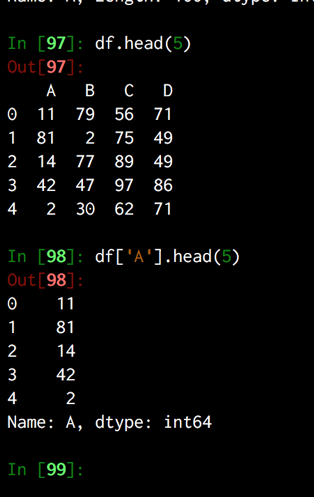
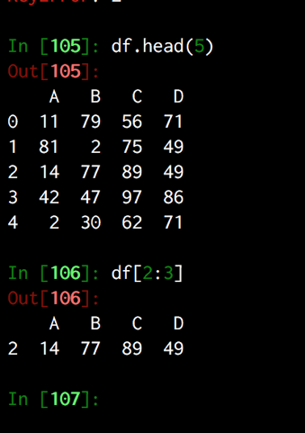

Title: datascience
Summary: Notes on useful datascience libs

# Useful datascience notes

[machine learning](https://ml-cheatsheet.readthedocs.io/en/latest/)
 

# numpy

#### **generate large arrays**

```python
np.arange(10000)
```

# matplotlib

[cheat sheet](https://www.cheatography.com/gabriellerab/cheat-sheets/matplotlib-pyplot/)

To fill in here.
- basic scatter plot
- basic histogram
- basic line chart

- dealing with datetimes

- basic linear regression plot

# pandas

#### Useful Info

Dataframes can be easily understood as a list of dicts

```python
data = [{1: 13, 2: 733, 3: 656, 4: 978, 5: 761},
 {1: 620, 2: 191, 3: 424, 4: 221, 5: 860},
 {1: 298, 2: 471, 3: 706, 4: 313, 5: 166},
 {1: 759, 2: 370, 3: 778, 4: 320, 5: 129},
 {1: 856, 2: 691, 3: 436, 4: 107, 5: 481}]
```

alternatively they can be though of as a dict of tuples but this isn't as obvious.

```python
x = {('a', 'b'): {('A','B'):1, ('A', 'C'):2},
('a', 'a'): {('A','C'):3, ('A', 'B'):4},
('a', 'c'): {('A','B'):5, ('A', 'C'):6},
('b', 'a'): {('A','C'):7, ('A', 'B'):8},
('b', 'b'): {('A', 'D'):9, ('A', 'B'): 10}}
```


#### Useful basics 

row count
```python 
len(df.index)
```

column count
```
len(df.columns)
```

setcopy warning

[articles on set copy warning](https://www.dataquest.io/blog/settingwithcopywarning/)

#### Selecting columns and data 

using the index operator.
Can be used in a variety of ways. Can pass in the following 
- a string, 
- a list of strings
- a list of booleans

##### a string

will return a df of that column



##### a list of strings

will return a df of all those columns


##### a slice

will return a df for rows between the slice



##### a list of booleans

will true a df where all values where true


The index operator, selecting columns

