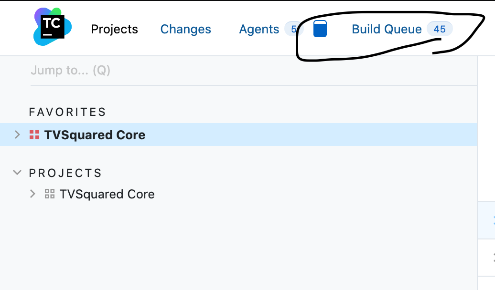
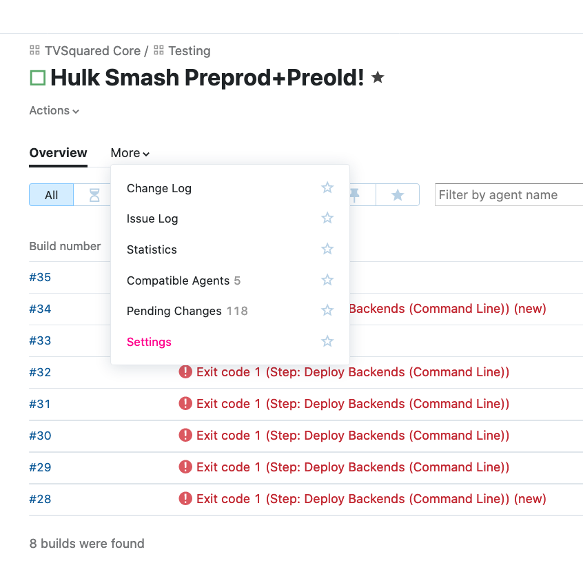
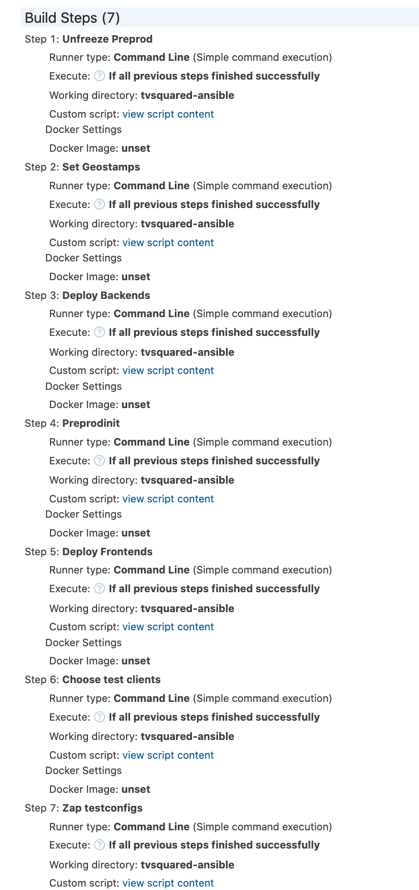
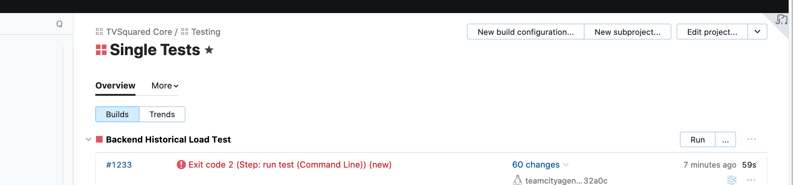
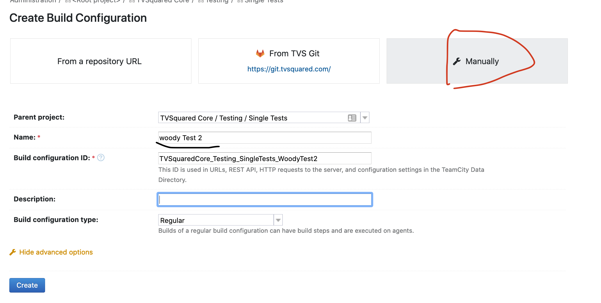
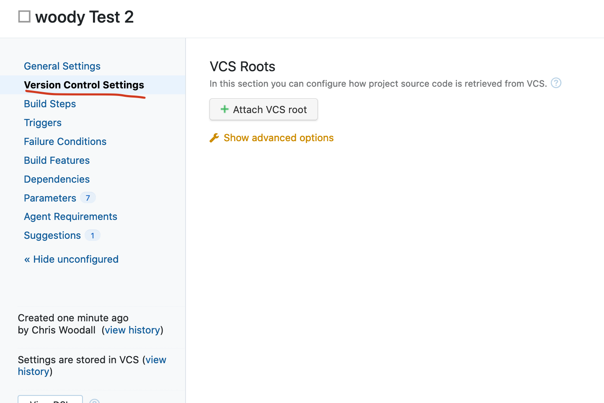
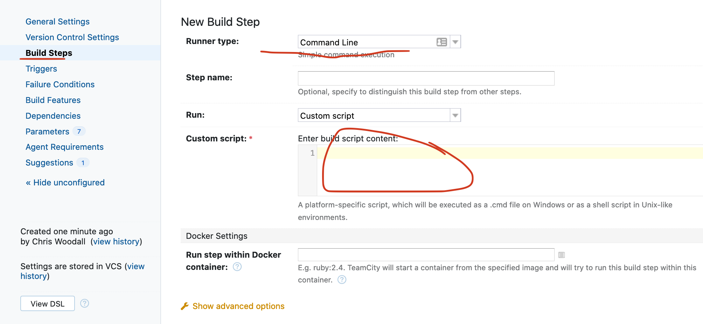
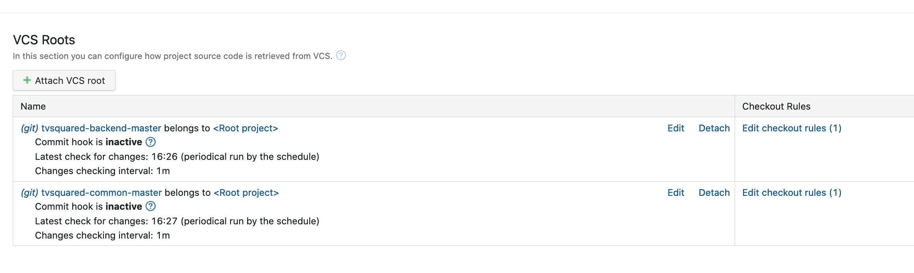
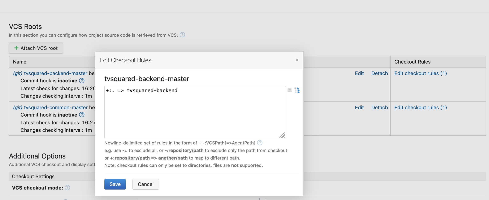
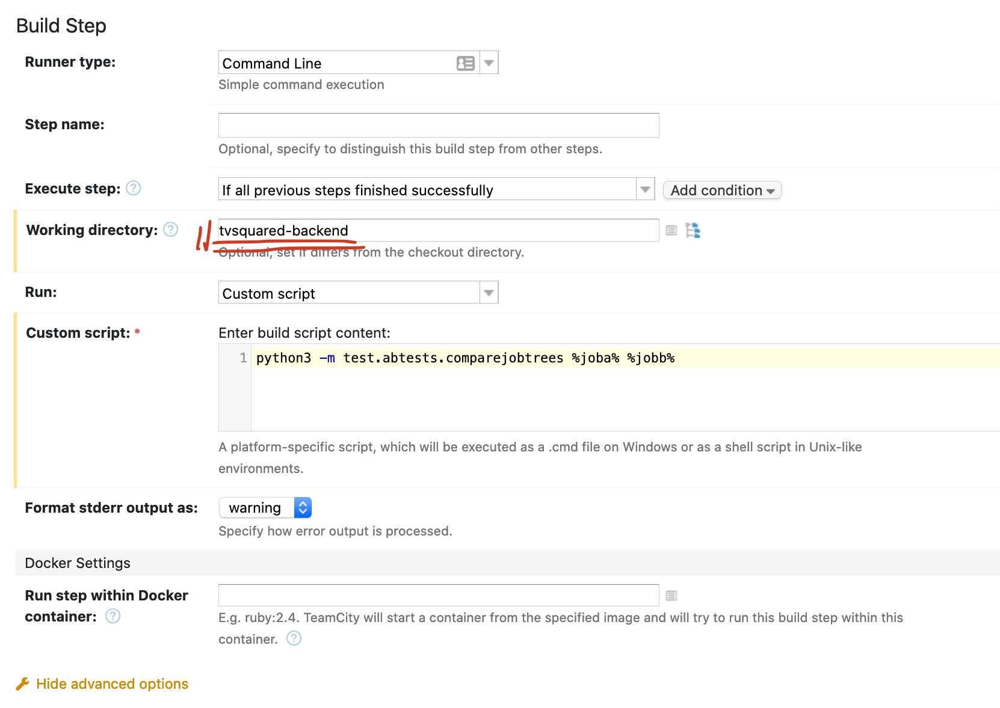

title: devops:q:wq
summary: devopsie shite!
- - -

# devops

## microsoft azure

### using bings image search

you need both the azure_search_api key as well as the cognitive_ something key
you need both

## troubleshooting strategies  

### One of my services i.e. a database doesn't work

1. Do you have a clean install? Y/N.
Is there only one?  
Is the install the most recent?  
Check by find out versions being run etc.  
useful commands
```bash
brew list mongodb
brew unstall mongodb 
brew unstall mongodb -f # uninstalls all versions install on system. 
```

2. Does the install run Y/N
shut down all other processes that might be running  
restart the service. Is it now running? Y/N  
Can you run it using brew / manually?  
Does running it give any useful info?  
```bash
ps -ef | grep mongo # processes running
tail -f <log file> # live debug of log files
```

3. Is it a dataissue Y/N  
If things run manually but not using the service then suggests that this might be the issue  
If you suspect Ydo the following.  
- find db files (/usr/local/var/mongodb for mongo)  
- remane the folder  
- create a new folder with the name of the old one.  

4. Is there a config issue Y/N

## deploy management 

### ansible

#### basic concepts

**control node:** a machine with ansible installed
**tasks:** unit of action i.e. do something
**playbooks:** ordered lists of tasks and variables. Written in yaml.
**hosts/managed nodes:** network devices that are controlled with the control node.
**inventory:**all your mananged nodes.


#### add roles to your path

see tvs.md 


## package management 
- - - 

### homebrew

system wide package manager for macOS
```bash
/usr/local/Cellar/<package>
```

#### brewfile

use this to install / maintain brew packages.  
make sure you have the stuff installed

```bash
 brew tap Homebrew/bundle
```

install with
```bash
brew bundle
```

#### get brew to update its package list
```bash
brew update
```

#### update all packages installed
```bash
brew upgrade
```

#### switch to a different version of a keg
```bash
brew switch <different keg>
```

#### tidy up brew, generate free space

```bash
brew clean up
```

#### get details about brew package
```bash
brew info <package>
```

#### start and stop specific services used with brew
like postgres
```bash
brew services stop <service>
brew services start <service>

example
brew services stop mongodb
brew services start mongodb
# alternatively 
brew services restart postgresql
```

#### please use brew to update and upgrade your databases

```bash
brew postgresql-upgrade-database
```

caveats: 
- don't hop versions, only upgrade 1 version at a time.

##### if that fails

look into pg_upgrade
run manually so you can see what is happening

#### link packages together
```bash
brew link <blah>
```


### python 

package management in python is a nightmare

#### venvs

#### virtual-env

#### pip

#### pipx 

A pip tool for installing stand alone CLI tools that are isolated in venvs
I currently have csvkit and mkdocs installed using this but only
as I can install additional dependencies using 

```
pipx runpip mkdocs install mkdocs-material-extensions
```

#### pyenv

Have multiple python versions on your machine

##### set up a venv with a specific python version

```bash
pyenv local <py version>
python3 -m venv env
##### List all available versions

```
pyenv install --list
```


##### issues installing pyenv due to openssl

```bash
brew uninstall --force --ignore-dependencies openssl@1.1
brew install -v 3.5.2
brew install openssl@1.1
```

##### switch py3.5 to py3.7 and back
This should work for your whole system
```bash
pyenv global 3.5.0
or 
pyenv global system
```
You will need to install all the relevant pip packages into the correct python folder

This should work for local specific projects.
Note: your work machine is currently setup like a local not global
```
pyenv local 3.7.7
pyenv local system
```


##### get what pyenv version is currently being used
```
pyenv versions
```

Install 

#### poetry

##### init a repo if you already have a toml and lock file

```bash
poetry install
```

##### add or update a package

```
poetry add mock=4.0.2
```
commit the lock and toml file once it goes through OK.

##### add a team specific dependency to the .toml file. 

```sh
poetry add jupyterlab -E datascience --optional
```

need to the following section of the pyproject.toml file also
```
[tool.poetry.extras]
datascience = ['jupyterlab', 'seaborn']
```

then install the addtional packages with

```
poetry install -E datascience
```

##### troubleshooting

good idea to setup pyenv with the python version you want to use before 
you start.

```
The current supported Python versions are 2.7.10
Because hug (2.4.1) requires Python >=3.4
 and no versions of hug match >2.4.1,<3.0.0, hug is forbidden.
So, because <...> depends on prodigy (1.6.1) which depends on hug (>=2.4.1,<3.0.0), version solving failed.
```

delete the venv if you already made one and do it again with correct python version

## aws
- - - 
do aws stuff from cmdline

### s3

#### view sample of files
can pipe stuff to stdout using -
```bash
aws s3 cp s3://tvsquared-userdata/3871/1/app-usersessions/1547468023214-combined_Q3_8_app_FR_1.csv.gz - | gzcat | head
```

#### transfer from s3 to local
```bash
aws s3 cp "s3://tvsquared-userdata/collector/282-1/2018.05/visits-282-1-2018.05.31.json.bz2" .
```

#### transfering folders between buckets
s3 has a flat folder structure so need to use the --recursive flag
```bash
aws s3 cp s3://tvsquared-userdata/collector/282-1/2018.01/ s3://tvsquared-userdata-preprod/collector/282-1/2018.01/ --recursive
```

#### transfer folders from local to s3
```bash
aws s3 cp --recursive . "s3://tvsquared-receivedata/tivo"
```

## Virtual Machines

### setting up macos in a virtual box

for catalina. This was an absolute pain.
run on virtual box 6.2 on mac os with catalina. meta I know.

Steps
- create a catalina iso
    - download catalina installer from the apps store. you want to turn off all the autoinstalling stuff
    - run this script to generate the iso.
        ```bash
hdiutil create -o /tmp/Catalina.cdr -size 5200m -layout SPUD -fs HFS+J
hdiutil attach /tmp/Catalina.cdr.dmg -noverify -mountpoint /Volumes/install_build
sudo /Applications/Install\ macOS\ Catalina.app/Contents/Resources/createinstallmedia --volume /Volumes/install_build
mv /tmp/Catalina.cdr.dmg ~/Desktop/InstallSystem.dmg
hdiutil detach /Volumes/Install\ macOS\ Catalina
hdiutil convert ~/Desktop/InstallSystem.dmg -format UDTO -o ~/Desktop/Catalina.iso
        ```
    - if the iso fails to create with a error(22, 0) message. close everything try again. still issue then restart.

- install virtual box and extensions
    - some problems getting it the correct access on mac that I haven't managed to resolve on ubuntu

- create the box
    - make sure you have enough space on the machine (catalina requires at least 25 GB!)
    - follow the setup steps from other articles
    if you get stuff at a weird shell
        - re-create the iso
    if the install sticks while loading at the 14 min mark
        - set system processors to more than 1.
    if the keyboard doesn't recognise
        - pause and un-pause the machine

### setting up an SD card as VM disk

format SD card. for mac make sure it is Mac OS extended Journal, with GUID partitioning. 
Need to format before you start from the ROOT in diskultily

```
# find disk name
diskutil list
# unmount disk
diskutil unmountDisk /dev/disk2
# grant access
sudo chown $USER /dev/disk2*
# create link.vmdk
VBoxManage internalcommands createrawvmdk -filename /Users/chriswoodall/VirtualBox\ VMs/link.vmdk -rawdisk /dev/disk2
# create disk in VB using gui and .vmdk 
open -a VirtualBox
# might need to unmount again to get it to work
diskutil unmountDisk /dev/disk2
# on restart will need to grant access to disk again
sudo chown $USER /dev/disk2*
```

### **VERROR read permissions**

 restart laptop and run restart script on restart


## OS's

### Linux


#### basics

Become Root User
>>> sudo su
=======
## linux

### cross system stuff

#### using app images

just download and grant exec privlegies
```bash
chmod +x <appimage>
```

### ubuntu
>>>>>>> Stashed changes

Stop being root User
>>> exit

Operating system type
>>>cat /etc/os-release
Login in root
>>> sudo -s

Generate ssh key  
>>> xclip -sel clip < ~/.ssh/id_rsa.pub
Show all modules used
>>> lsmod

### OsX

#### **encrypt machine**
[guide to encrypting mac](https://www.mactrast.com/2013/07/how-to-public-how-to-encrypt-time-machine-backups-with-os-x)

#### **machine keeps rename itself**
[this is annoying](https://apple.stackexchange.com/questions/55416/my-mac-minis-computer-name-keeps-changing-when-it-resumes-from-sleep)
```bash
sudo scutil --set HostName <new_hostname>
sudo scutil --set LocalHostName <new_hostname>
sudo scutil --set ComputerName <new_hostname>
```

####  Too large for the volume's format?

re-format the drive
[here](https://discussions.apple.com/thread/4263857)


## heroku

#### add ssh keys

```
heroku keys:add ~/.ssh/id_rsa.pub
```

## teamcity

Go to [teamcity](http://teamcity.tvsquared.private:8111/) and run whatever you need to  
Doc of teamcity issues and how to fix [here](https://docs.google.com/document/d/1HtPSvqL4lJ_tgKksx_7lPk8uWU9Zph3329fcZbUZifM/edit?usp=sharing)


### teamcity workers vs agents etc

teamcity agents or workers run the relevant scripts to deploy code onto the templates
the templates then copy the code onto the workers etc

### **deploy**
 
Deploys code to remote environment. Blats everything there
This restarts the whole environment so if new code has been incorportated then. I don’t know if it will update the psql databases.
Press the run button
Edit parameters and change branch to whatever branch you are interested in.
START / STOP 
Temporarily starts or stops the environment, required for access to psql + mongos
	DELPLOY CLONE CLIENT DATA TO REMOTE ENVIRONMENT
TVSquared CORE -> DATA -> Deploy One Test Client Data
Set parameters clientid, servername, new Client Id, new client name  
NOTE: new client name shouldn’t have any spaces

### **build list**

can interact with items in the build queue here. can boost priority etc.



### **what scripts are being run**

can see what scripts etc are being run here




### get actual teamcity output
before running the TC script

```
export TEAMCITY_VERSION=1
```

### unexpected error during build

```
Unexpected error during build messages processing in TeamCity 23:58:34
Unexpected error occurred during build message processing in TeamCity, please contact your system administrator
```

### making a test in teamcity

 - TVS Core -> Testing -> Single Tests -> New build configuration 







### make a test that used multiple repos

- add all the repos in the VCS 





- - -
zsh
- - -

## what gets loaded and when
| file | when its loaded | what to put in it |
| :--- | :---: | ---: |
| .zshenv | read every runtime | |
|.zprofile| read at login||
|.zshrc| read when iterative shell||
|.zlogin| read at login||
|.zlogout|read at login at log out||

- - -
## anisble
- - - 
