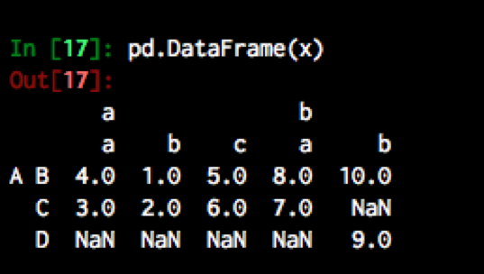
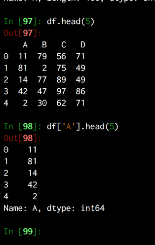
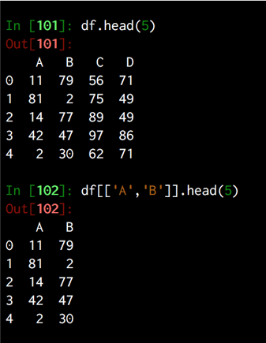
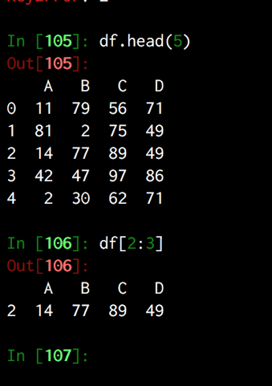
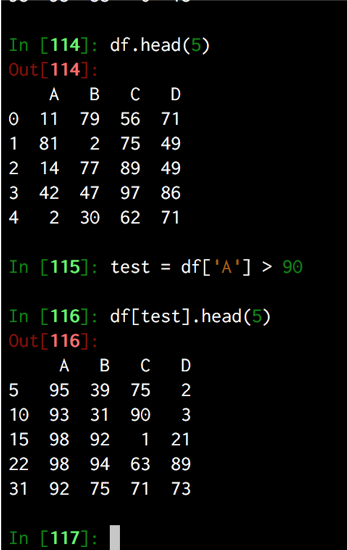

Title: pandas 
Summary: Notes on useful datascience libs
- - - 

# Useful Info

Dataframes can be easily understood as a list of dicts

```python
data = [{1: 13, 2: 733, 3: 656, 4: 978, 5: 761},
 {1: 620, 2: 191, 3: 424, 4: 221, 5: 860},
 {1: 298, 2: 471, 3: 706, 4: 313, 5: 166},
 {1: 759, 2: 370, 3: 778, 4: 320, 5: 129},
 {1: 856, 2: 691, 3: 436, 4: 107, 5: 481}]
```

alternatively they can be though of as a dict of tuples but this isn't as obvious.

```python
x = {('a', 'b'): {('A','B'):1, ('A', 'C'):2},
('a', 'a'): {('A','C'):3, ('A', 'B'):4},
('a', 'c'): {('A','B'):5, ('A', 'C'):6},
('b', 'a'): {('A','C'):7, ('A', 'B'):8},
('b', 'b'): {('A', 'D'):9, ('A', 'B'): 10}}
```


# Useful basics 

row count
```python 
len(df.index)
```

column count
```
len(df.columns)
```

setcopy warning

[articles on set copy warning](https://www.dataquest.io/blog/settingwithcopywarning/)

# Selecting Data 

## **The Index Operator**

using the index operator.
Can be used in a variety of ways. Can pass in the following 
- a string, 
- a list of strings
- a list of booleans

### a string

will return a series  of that column



to return a df then
```python
df[[columns u want]] # a df
df[columns u want] # a series 
```

### a list of strings

will return a df of all those columns



### a slice

will return a df for rows between the slice



### a list of booleans

will true a df where all values where true



## **The loc Operator**

syntax is as follows

```python
df.loc[<index row>,<index column>]

# example:
df.loc[0, 'A'] # would return the contents for row 0, column 'A'
```

### **select a specific cell value**

```python
df.loc[0, 'A'] # would return the contents for row 0, column 'A'
```

### **selecting rows**

```python
df.loc[[1,4]] # would return a df with the rows [1-4] 
df.loc[1] # would return a series from that role. 
```

### **selecting a column**

```python
df.loc[:, 5] # would return a series for all rows for column called 5
df.loc[:,[1, 5]] # would return a df for all rows for columnd 1 and 5
```

### **create a sub-frame**
 
 use a sub-frame of a larger df
```
df.loc[[<row indexes>],[<column index>]] # would return a df that that.
```

### **create a subframe using slicing**

```python
df.loc[:3, 4:] # can pass in a slice or two. Although don't do this. It is impossible to read. 
```

### **get all columns that  aren't**

```python
df.loc[:, df.columns != 'blarp'] # would return everything that isn't in column blarp 
```

### **get the last row in a df**
```python
df.loc[df.index[-1], columns]
```

### **dot notation**

```python
df.a # returns a series with values in column a 
```

# Indexing 

# Renaming

# Filtering

# Sorting

# Merging

# Grouping

# Modelling

# Import / Export

[guide to write / read modes](https://stackoverflow.com/questions/16208206/confused-by-python-file-mode-w)

## **excel sheets in pandas**
[guide](https://chrisalbon.com/python/data_wrangling/pandas_dataframe_load_xls/)


## **appending to a csv**

[append](https://stackoverflow.com/questions/17530542/how-to-add-pandas-data-to-an-existing-csv-file)

## **read from clipboard**

```python
df = pd.read_clipboard(',', parse_dates=['jobstarted', 'jobfinished'])
```


# Plotting

# Timeseries
Using timeseries shizzle in pandas
## **Useful timeseries stuff** 
[useful article](https://jakevdp.github.io/PythonDataScienceHandbook/03.11-working-with-time-series.html)

### **sampling a specific time**
  
```python
dt = df.between_time('21:00', '21:30')
de = df.between_time('05:30', '06:00')
```

### **comprehension to convert a timedelta inot hours**
```python
df['timedelta'] = [h.total_seconds()/3600 for h in df['time_difference']]
```

### **datetime indexes**
a lot of useful functionality comes from usings a datatime index 

```
df.index = pd.to_datetime(df.index) # one way to do it 
tng_visits_df.index = pd.DatetimeIndex(tng_visits_df['datadatetime'])

```

### **geenrate a timeseries**
```python
all_days = pd.date_range(‘from’, ‘to’, freq=’D’)
```

### **reindex a datetme index**

```python
dataframe.reindex(alldays).fillna90
```

### **Aggregate data into time buckets**

```python
agg10min =  tng_visits_df.groupby(pd.TimeGrouper(freq='10Min')).agg({'time': 'count'})
```

### **Plotting timedeltas**

``` python
df_combined['time_taken'].apply(lambda x: x.total_seconds() / 3600)
```

### **convert unix to datetime**

```python
df['datetime'] = pd.to_datetime(df['clock'], unit='s')
```

### **split datetime into date time**

```python
df['datetime'] = pd.to_datetime(df['clock'], unit='s')
temp = pd.DatetimeIndex(df['datetime'])
df["Date"] = temp.date
df['Time'] = temp.timePA
```


