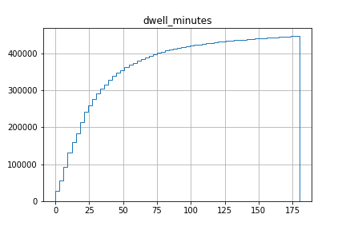
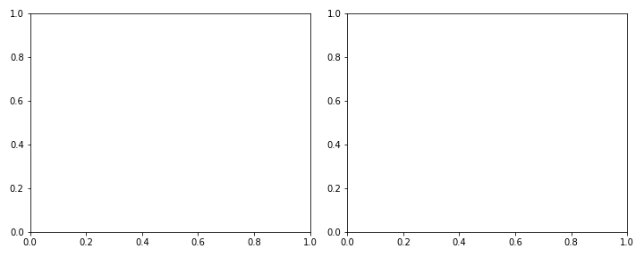
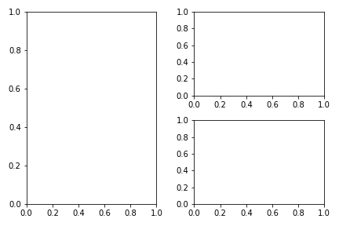
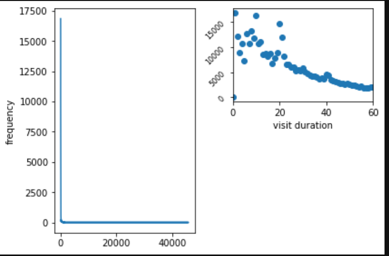
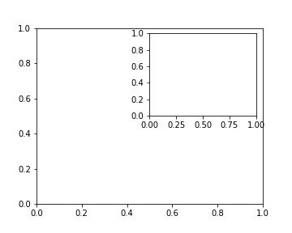
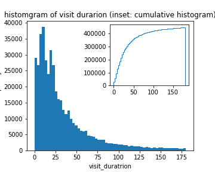

Title: Plotting
Summary: plotting 
- - - 

# plotting

## plot types

### scatter plot

### bar chart

### histogram

for viewing distributions of data. Count the frequency of a specific value and plot. 
Binning is important as both too large bins or too small can hide the underlying behaviour.

#### basic histogram

#### cumulative histogram

```python
data.hist(bins=60, cumulative=True, histtype='step')
```

###

## matplotlib

### plot layouts

#### 1to1 plot

empty 


```python
fig, ax = plt.subplots(figsize=[10, 4])
ax1 = plt.subplot(121)
ax2 = plt.subplot(122)
plt.tight_layout()
```

#### 1to2 plot

empty 

```python
ax1 = plt.subplot(121)
ax2 = plt.subplot(222)
ax2 = plt.subplot(224)
plt.tight_layout()
```


```python
ax1 = plt.subplot(121)
ax1.plot(df['dwell_minutes'], df['number_of_visits'])
ax1 = plt.subplot(121)
ax1.set_ylabel("frequency")


ax2 = plt.subplot(222)
ax2.scatter(df['dwell_minutes'], df['number_of_visits'], )
ax2.set_xlabel("visit duration")

ax2.set_xlim(0, 60)
for tick in ax2.get_yticklabels():
    tick.set_rotation(45)
    tick.set_fontsize(8) 
plt.tight_layout()
```


#### inset plots


```python
fig, ax = plt.subplots(figsize=[5, 4])
axins = ax.inset_axes([0.5, 0.5, 0.47, 0.47])
```

with some data


```python
fig, ax = plt.subplots(figsize=[5, 4])
ax.hist(<histo_df>, bins=60)
axins = ax.inset_axes([0.5, 0.5, 0.47, 0.47])
axins.hist(<histo_df>, bins=60, cumulative=True, histtype='step')
```
